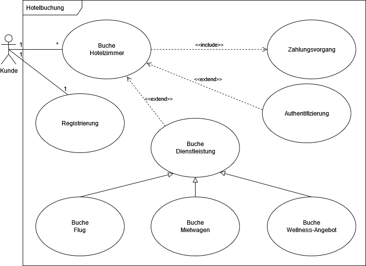
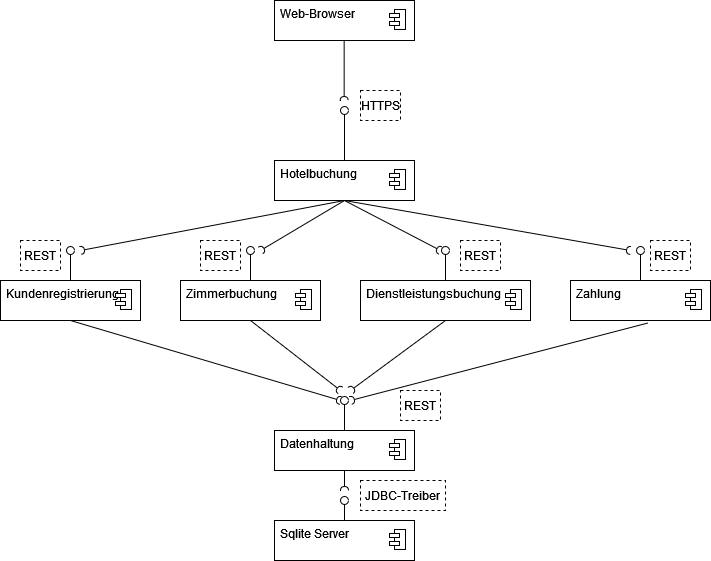
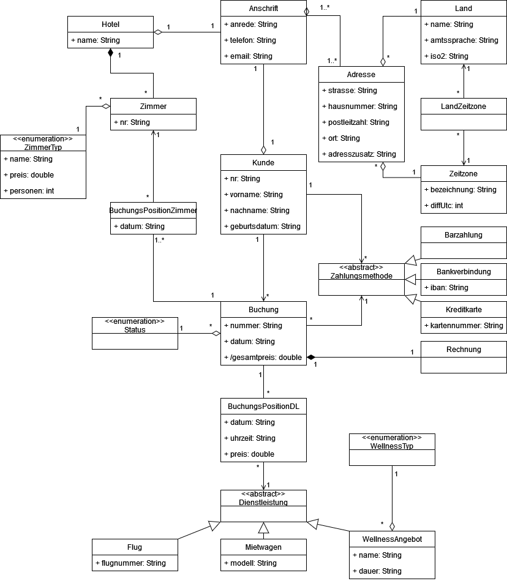

# Software Engineering I Studienarbeit

mit SpringBoot 2.7.5 und Hibernate, unterstützt durch Maven

## Start des Programms

Das Programm wird durch die Main-Methode der Klasse Main im package main gestartet.
Swagger-UI kann dann über folgenden Link geöffnet werden:  http://localhost:8080/api/swagger-ui/

## Docker Einbindung

Das Projekt ist für Docker konzipiert. Möchte man das Docker-Image selbst erzeugen, muss ein Build mit der im Dockerfile
angegebenen JDK durchgeführt werden, anschließend dann docker build.

## Packages

### com.chabbay.dataobjects

enthält die Datenstruktur

### com.chabbay.errorhandling

Fehlerbehandlung

### com.chabbay.main

Startet die Anwendung

### com.chabbay.security

Passwort-Authentifizierung
`username: user`
`password: password`

### com.chabbay.swagger

Konfiguration von SwaggerUI

## Diagramme

### Anwendungsfalldiagramm

### Komponentendiagramm

### Klassendiagramm

### BPMN