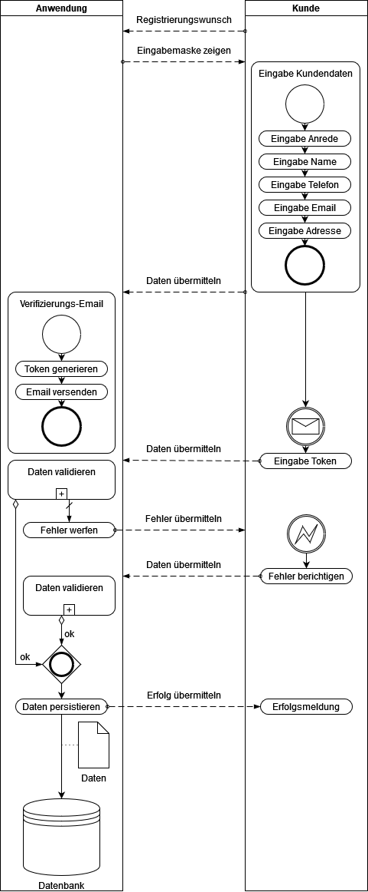

# Software Engineering I Studienarbeit

mit SpringBoot 2.7.5 und Hibernate, unterstützt durch Maven

## Start des Programms

Das Programm wird durch die Main-Methode der Klasse Main im package main gestartet. In IntelliJ steht dafür eine
Run-Konfiguration zur Verfügung.
Swagger-UI kann dann über folgenden Link geöffnet werden:  http://localhost:8080/api/swagger-ui/

## Docker Einbindung

Das Projekt ist für Docker konzipiert. Möchte man das Docker-Image selbst erzeugen, muss ein Build mit der im Dockerfile
angegebenen JDK durchgeführt werden, anschließend dann docker build. Das erzeugte JAR-File wird dann im Container
ausgeführt. Auch hierfür gibt es eine Run-Konfiguration für IntelliJ, es muss lediglich erst eine Verbindung zu Docker
aufgebaut werden (unter Services). 
Das Docker-Image wird zusätzlich auf Docker-Hub zur Verfügung gestellt und kann von dort gepullt werden.

## Verwendung

Die Anwendung kann direkt über SwaggerUI getestet werden, oder über ein Tool wie Postman. Über die Klasse LoadDatabase
wird die Datenbank initial befüllt.
Die API ist passwortgeschützt mit
`username: user`
`password: password`
und beachtet die referentielle Integrität. Es können bei insert und update nur existierende Fremdschlüssel vergeben
werden und delete wird für referenzierte Objekte geblockt.

## Abgrenzung

Die API bietet nicht das volle Datenmodell der geplanten Anwendung und auch nicht den vollen geplanten Funktionsumfang,
da es sich um eine reine Demo-Anwendung handelt, aber bietet dennoch einen Eindruck wie die fertige Anwendung aussehen
könnte. 
Es können daher lediglich Kundendaten angelegt werden.

## Packages

### com.chabbay.dataobjects

enthält die Datenstruktur

### com.chabbay.errorhandling

Fehlerbehandlung

### com.chabbay.main

Startet die Anwendung

### com.chabbay.security

Passwort-Authentifizierung
`username: user`
`password: password`

### com.chabbay.swagger

Konfiguration von SwaggerUI

## Diagramme

### Anwendungsfalldiagramm

### Komponentendiagramm

### Klassendiagramm

### BPMN

